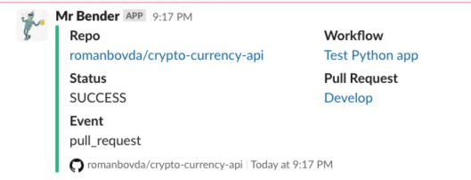

[](https://github.com/romanbovda/crypto-currency-api/actions/workflows/deploy.yml)
[](https://github.com/romanbovda/crypto-currency-api/actions/workflows/test.yml)
## Coinbase's currency API Demo:

This is a simple API service, which helps you to get fiat BTC price. For instance:
```
{hostname}/currency/UAH
```
Architecture:
- Simple Python API on Flask
- AWS EKS cluster managed by Terraform
- Github actions as a CI/CD
- Docker and Helm for app deployment

## Run API locally 

```commandline
$ make develop
```
### Perform tests

```commandline
$ make test
```

## Infrastructure provisioning

Use the package manager homebrew to install the AWS CLI.
```commandline
$ brew install awscli
```
After you've installed the AWS CLI, configure it by running `aws configure`.

When prompted, enter your AWS Access Key ID, Secret Access Key, region and output format.
```commandline
$ aws configure
AWS Access Key ID [None]: YOUR_AWS_ACCESS_KEY_ID
AWS Secret Access Key [None]: YOUR_AWS_SECRET_ACCESS_KEY
Default region name [None]: YOUR_AWS_REGION
Default output format [None]: json
```
In your terminal, clone the following repository. 

```commandline
$ cd terraform/crypto-eks-cluster

$ terraform init

$ terraform verify

$ terraform plan

$ terraform apply
```

### (Optionally) Deploy Kubernetes Metrics Server
The Kubernetes Metrics Server, used to gather metrics such as cluster CPU and memory usage over time, is not deployed by default in EKS clusters.

Download and unzip the metrics server by running the following command.

```commandline
$ wget -O v0.3.6.tar.gz https://codeload.github.com/kubernetes-sigs/metrics-server/tar.gz/v0.3.6 && tar -xzf v0.3.6.tar.gz

```
Deploy the metrics server to the cluster by running the following command.

```commandline
$ kubectl apply -f metrics-server-0.3.6/deploy/1.8+/
```

Verify that the metrics server has been deployed. If successful, you should see something like this.

```commandline
$ kubectl get deployment metrics-server -n kube-system

NAME             READY   UP-TO-DATE   AVAILABLE   AGE
metrics-server   1/1     1            1           4s
```

### Slack notifications

Test and deploy actions serviced by Mr. Bender - SRE helper bot


Get endpoint name:

```commandline
kubectl get svc crypto-currency-api -o json | jq -r '.status.loadBalancer.ingress[0].hostname'
```